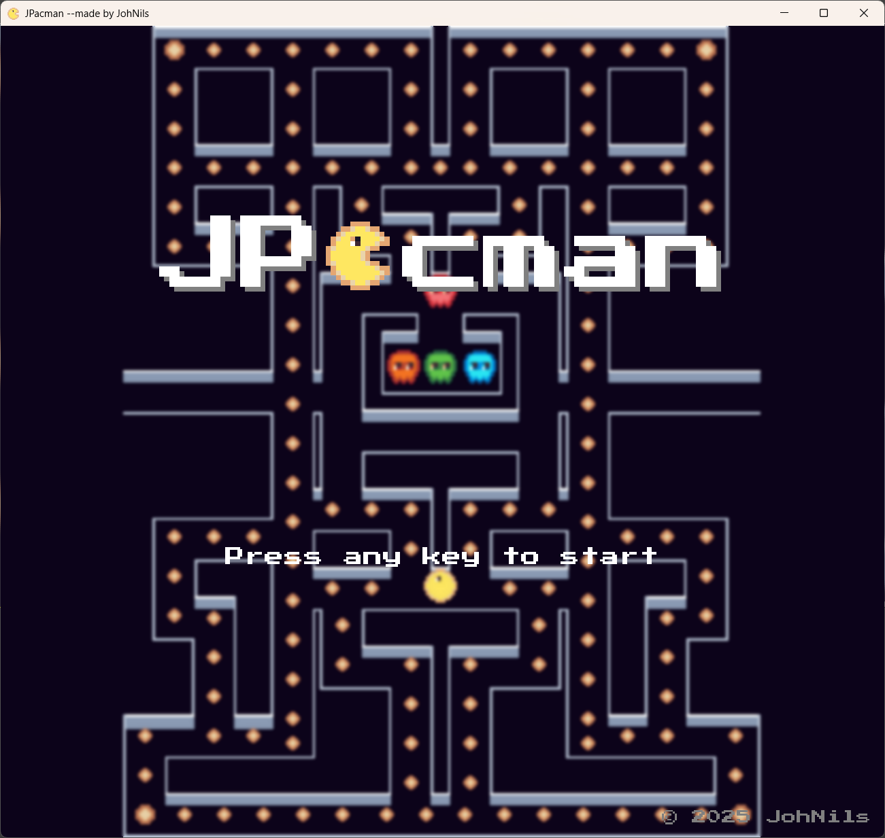
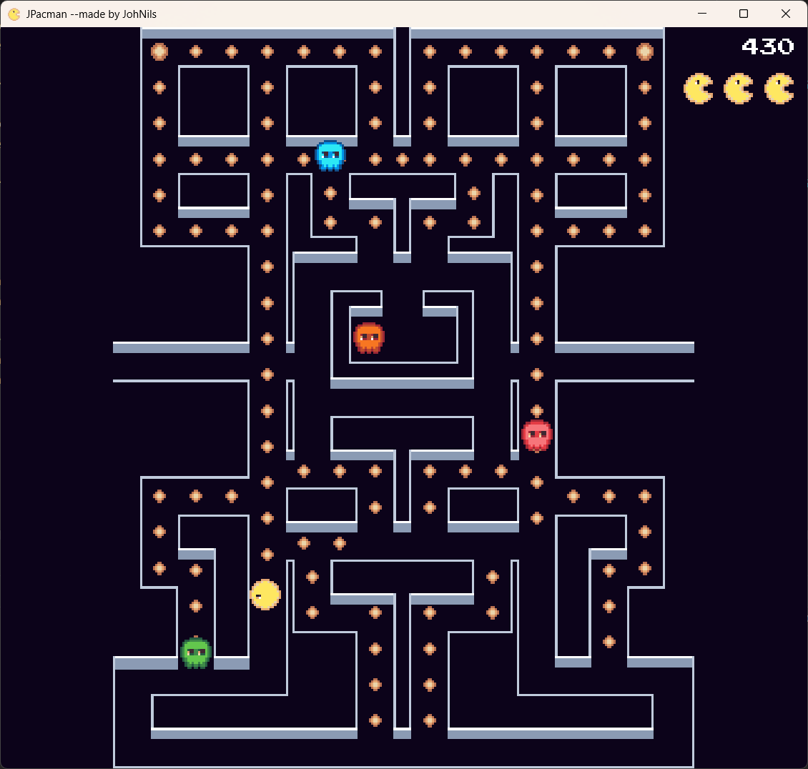
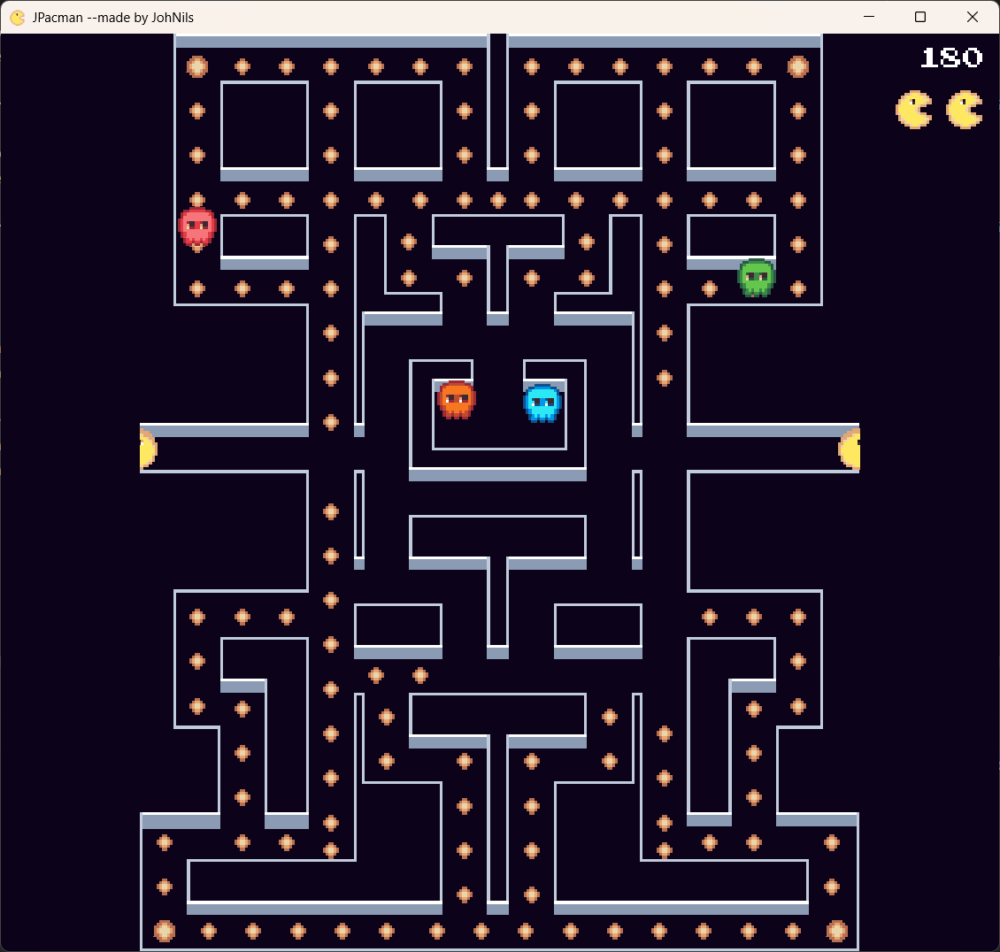
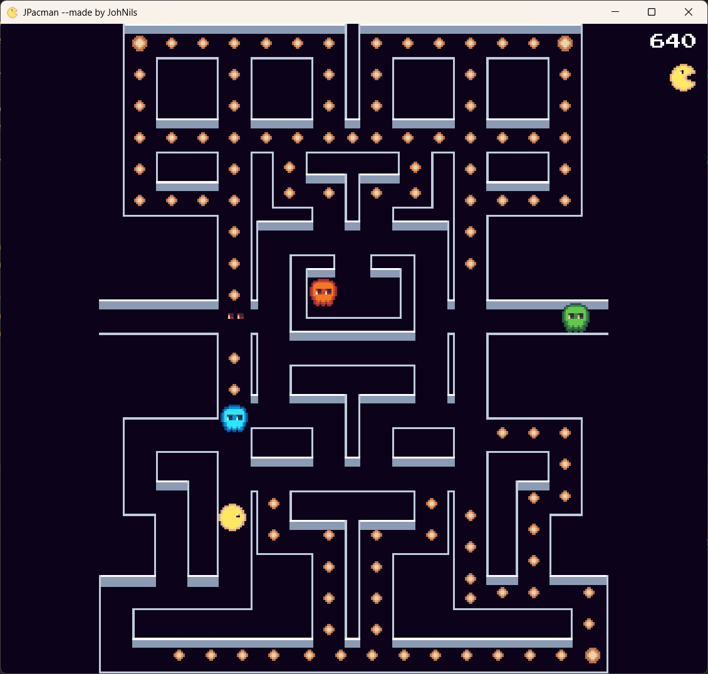
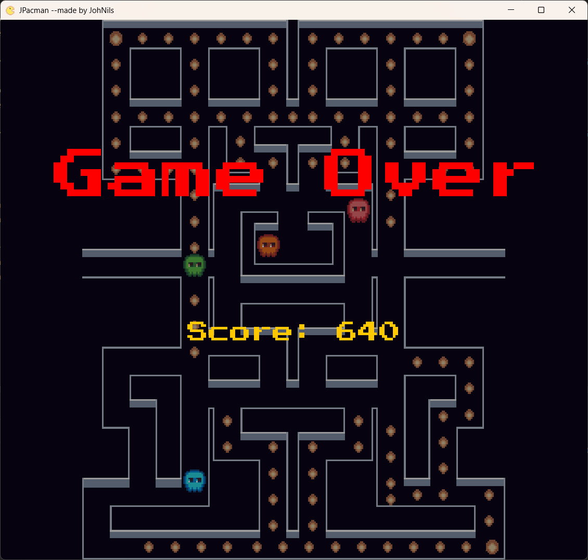

# JPacman

A Pacman clone written in Java using Java Swing.
You can find a build on https://johnils.itch.io/jpacman.

## Resources used

- Assets: https://vladpenn.itch.io/pacman
- Font: https://fonts.google.com/specimen/Press+Start+2P

## Screenshots

